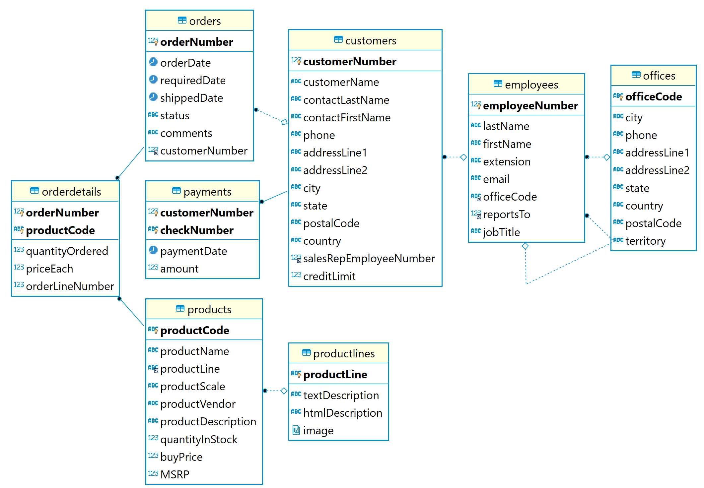

# Advanced queries

- Repository: `advanced-queries` (just add a link to your form, or make a sheet of your answers)
- Type of Challenge: `Learning challenge`
- Duration: `we'll see`
- Deployment strategy : `n/a`
- Team challenge : `solo`

## Learning objectives
- Able to look up information about sql on the web
- Able to query a complicated database schema and answer data questions

## The mission

You'll be diving into all secret data of a (fictional) company!
In order to make sense of it all, you'll need to flex your SQL muscles.

There is [quiz](./SQL-questionnaire.md) waiting for you to prove how much you discovered.
Don't stress out, it is not a test, and you can try as often as you want!

Go GO GO!

## 🌱 Must-haves

### The syntax: learning SQL

This [basic MySQL tutorial](https://www.mysqltutorial.org/basic-mysql-tutorial.aspx) explains some basic SQL statements. If this is the first time you have used a relational database management system, this tutorial teaches you everything you need to know to work with MySQL such as querying data, updating data, managing databases, and creating tables.

This is a selection of all interesting and common used ways of reading data out MySQL.
With the knowledge you will gain here, you will be able to answer all questions below!

  
All you ever might want to know about databases

1. Querying data
    - [SELECT – show you how to use simple SELECT statement to query the data from a single table.](https://www.mysqltutorial.org/mysql-select-statement-query-data.aspx)

1. Sorting data
    - [ORDER BY – show you how to sort the result set using ORDER BY clause. The custom sort order with the FIELD function will be also covered.](https://www.mysqltutorial.org/mysql-order-by/)

1. Filtering data
    - [WHERE – learn how to use the WHERE clause to filter rows based on specified conditions.](https://www.mysqltutorial.org/mysql-where/)
    - [SELECT  DISTINCT – show you how to use the DISTINCT operator in the SELECT statement to eliminate duplicate rows in a result set.](https://www.mysqltutorial.org/mysql-distinct.aspx)
    - [AND – introduce you to the AND operator to combine Boolean expressions to form a complex condition for filtering data.](https://www.mysqltutorial.org/mysql-and/)
    - [OR– introduce you to the OR operator and show you how to combine the OR operator with the AND operator to filter data.](https://www.mysqltutorial.org/mysql-or/)
    - [IN – show you how to use the IN operator in the WHERE clause to determine if a value matches any value in a list or a subquery.](https://www.mysqltutorial.org/sql-in.aspx)
    - [BETWEEN – show you how to query data based on a range using BETWEEN operator.](https://www.mysqltutorial.org/mysql-between)
    - [LIKE  – provide you with technique to query data based on a specific pattern.](https://www.mysqltutorial.org/mysql-like/)
    - [LIMIT – use LIMIT to constrain the number of rows returned by SELECT statement](https://www.mysqltutorial.org/mysql-limit.aspx)
    - [IS NULL – test whether a value is NULL or not by using IS NULL operator.](https://www.mysqltutorial.org/mysql-is-null/)
    - [Subquery – show you how to nest a query (inner query) within another query (outer query) and use the result of the inner query for the outer query.](https://www.mysqltutorial.org/mysql-subquery/)

1. Joining tables
    - [Table & Column Aliases – introduce you to table and column aliases.](https://www.mysqltutorial.org/mysql-alias/)
    - [LEFT JOIN – return all rows from the left table and matching rows from the right table or null if no matching rows found in the right table.](https://www.mysqltutorial.org/mysql-left-join.aspx)

1. Grouping data
    - [GROUP BY – show you how to group rows into groups based on columns or expressions.](https://www.mysqltutorial.org/mysql-group-by.aspx)
    - [HAVING – filter the groups by a specific condition.](https://www.mysqltutorial.org/mysql-having.aspx)

1. Common functions
    - [count() - Return the number of rows in a group, including rows with NULL values.](https://www.mysqltutorial.org/mysql-count/)
    - [avg() - Return the average of non-NULL values.](https://www.mysqltutorial.org/mysql-avg/)
    - [sum() - Return the summation of all non-NULL values a set.](https://www.mysqltutorial.org/mysql-sum/)
    - [max() - Return the highest value (maximum) in a set of non-NULL values.](https://www.mysqltutorial.org/mysql-max-function/)
    - [min() - Return the lowest value (minimum) in a set of non-NULL values.](https://www.mysqltutorial.org/mysql-min/)
    - [Shows you the how to manipulate date and time data effectively.](https://www.mysqltutorial.org/mysql-date/)

If you feel like you want extra practice, have a look at this [free mini course about MySQL](https://github.com/WebDevSimplified/Learn-SQL) and the accompanying [video](https://youtu.be/p3qvj9hO_Bo).

### Import the database

Every database can always be exported (or imported) as a sql file.
Download [the sample database](mysqlsampledatabase.zip) and import it through your database manager in a newly created database. Make yourself familiar with the structure.

> **MSRP**
> Because our sample database is American it uses the abbreviation MSRP, short for *manufacturer's suggested retail price*.
The manufacturer's suggested retail price (MSRP) is the price that a product's manufacturer recommends it is sold for at point of sale. The MSRP is also referred to as the list price by some retailers.

### Quiz time!

Solve question 1-10 mentioned in the form [mentioned above](#the-mission).

## 🌼 Nice to have (doable)

Making your way through company secrets!
Solve question 11-25.

## 🌳 Nice to have (hard)

Wow, you made it this far?
Solve question 26-50.
