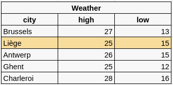
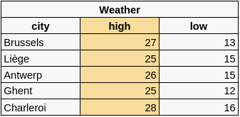

# Intro to Databases (MariaDB)
- Repository: `none`
- Type of Challenge: `Learning`
- Duration: `2 days`
- Team challenge : `solo`

## Introduction
Imagine a website like any other, This website has images, texts an maybe users or blogs/posts, ...

This information should be stored in a permanent way, but still accessible to update efficiently when needed. You can use simple files like `Excel sheets`, `.json` files or even `.txt` or `.doc`... But the downside with those files is that in order to update something, you would need to: got to the file - open it - update it - save it - close it again and again and again, each time you want to update it.

### A solution?

To overcome these limitations, we link our backend with another server: a database server (example: an `SQL` server).

Its role is specifically to store data + have interaction with the stored data. This also happens very fast which minimizes the risk of "timeouts".

## Learning objectives
- Understand the terms: Databases, SQL, DBMS, Rows, Columns, Tables, CRUD
- Visualize how a database would look like (row and column structure)

## DBMS (Database Management Systems)
There are multiple software programs which will allow you to manipulate databases. These systems are called "Database Management Systems/Engines", or in short: `DBMS`.

For web applications we tend to use:
- MySQL (and it's recommended version: MariaDB)
- SQLite
- PostgreSQL

Since SQL is overwhelmingly popular, it is also what we will be using in our training. The cool thing about SQL is that it is a language used by other DBMS, so learning SQL will help you have an easier transition when changing systems if needed. 

## What does a database look like?

A **database** is actually just a group of one or more tables containing... data. Much like an Excel table or Google sheets. Here is a database containing only one table : "weather"

In this example, the **table** "weather" contains the data to present the weather forecasts for major Belgian cities (minimum and maximum temperature).

Each city has its own **row**.  

Each row (therefore, here, city) is described by as many **columns** as necessary by the application.  

## CRUD

Essentially, for a web developer, there are 4 different types of actions when interacting with a database (DB):
- <u>**C**reating data:</u> Add a row to your table or a table to your DB
- <u>**R**eading data:</u> Select data (can be a row, a cell, a group of rows/cells) 
- <u>**U**pdating data:</u> Modify the information stored in one or multiple rows
- <u>**D**eleting data:</u> Delete a row

## Exercises:

1. [Setting up](./1.Set-up/Setup.md)
1. [SQL basics + database managers](./2.SQL/Basics.md)
1. [Advanced queries](./2.SQL/Advanced.md)