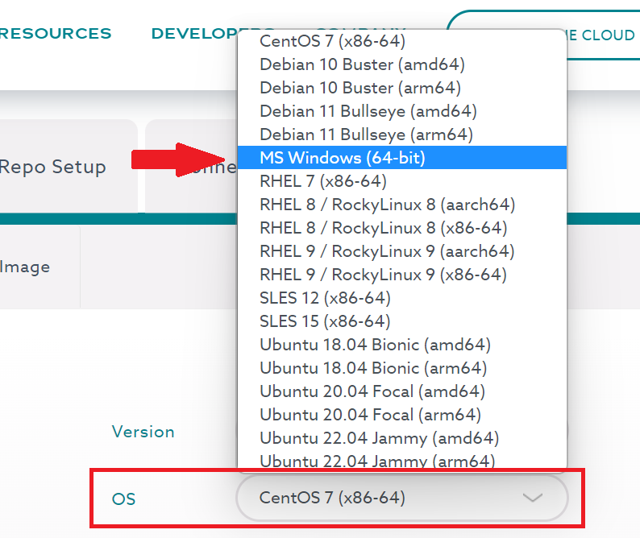

> I couldn't find a fully supported window emoji, so 🎤 will represent *micro*soft.
All tools mentioned are either free, or have a free version for you to use.

# 🎤 Windows:
For windows, we are going to download a setup file from the website.
This download will open an installment wizard that will help us set up the configuration of the MariaDB software.

## Wizarding:
1. Go to the MariaDB [download page](https://mariadb.com/downloads). 
    * **NOTE**: Go to the `.com` website, not the `.org`!
2. On the page you will find a label `OS`, select the `MS Windows (xx-bit)`.
    * [](../_assets/windows-download-01.png)
3. Click on install > once installed > Open the file
4. Follow default steps. 
    * **When a password is asked**, set up a password (do not lose it!). During the training, you can also opt not to use a password by leaving those fields empty. but once in production, this would be a severe security risk.
    * **Enable Networking**: the default is a TCP port that is set on `3306`.
    * **Click on "install"** at the end!

## Configuration:

1. Once The wizard is done with installing MariaDB: you can open your Windows button and search for `MySQL Client`.
   * This program will open a window looking like a terminal
2. This window will ask for a password (the one you used a few steps ago).
   1. Execute the commands below to set up your profile/user:
      * NOTE: Replace the words that are marked with `< >` around it.

      *This will create a database and give it a name.*
      ```
      STEP 1: create database <YourDatabaseNameHere>;
      ```
      *This will create a user that allows you to access your databases as that user*
      ```
      STEP 2: create user <yourName>@localhost identified by 'password';
      ```
      *This gives your profile access to your database, protected by your password (if the password is set as empty, then you can connect by leaving the password empty)*
      ```
      STEP 3: GRANT ALL PRIVILEGES ON <yourDatabaseName>.* TO <yourName>@localhost IDENTIFIED BY 'password';
      ```
      *This will show you the current MariaDB version you are using*
      ```
      STEP 4: select version();
      ```

3. Finally! Now we can connect to a Database!
   * follow the command below once you have a database to open!
   ```
   mysql> connect <yourDatabaseName>;
   ```

Done!

Let's go to the [next step](../2.SQL/Basics.md) !