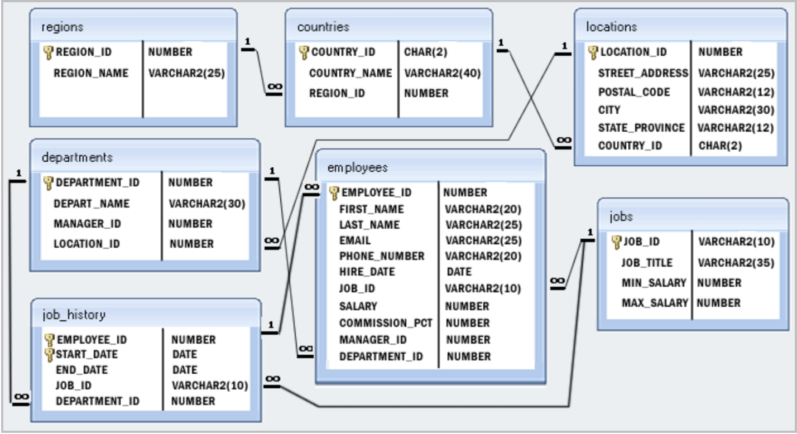

# Intro to relational databases and schemas

## Practical Information

-   Repository: `no repository`
-   Deadline: 1 day

## Learning Objectives

-   Model a simple relational DB model
-   Perform CRUD operations on a Database

## Exercise

Today, you will use SQL queries to another extent.
Provided with this README, is a file called [database](./database), you will train to create sql queries using that file!

To help you, here is the db schema of said table.



You will use sqlite that you installed yesterday.

You will learn a lot of new things so keep calm and tackle one challenge at the time!

You can do it!

## Challenges

To start, use your terminal to navigate into the folder where you cloned the file database, and run :

```
sqlite3 database
```

### SELECT

1. Write a query to display the names (first_name, last_name) of all the employees. ✅
   SELECT first_name, last_name FROM employees;

2. Write a query to get all employee details and order them by first name, descending. ✅
   SELECT \* FROM employees order by first_name ASC;

3. Write a query to get the total salaries payable to employees. ✅
   SELECT sum(salary) as total_salary FROM employees;

4. Write a query to get the maximum and minimum salary from employees table. ✅
   SELECT max(salary) as max_salary, min(salary) as min_salary FROM employees;

5. Write a query to get monthly salary (round 2 decimal places) of each and every employee. To get the monthly salary of an employee, divide the annual salary by `12,2` ✅
   SELECT first_name, last_name, ROUND(salary / 12, 2) AS monthly_salary FROM employees ORDER BY last_name ASC ;

### Restricting and Sorting Data

6. Write a query to display the names (first_name, last_name) and salary for all employees whose salary is not in the range $10,000 through $15,000 ✅
   SELECT first_name, last_name, salary from employees where ( salary < 10000 or salary > 15000 );

7. Write a query to display the names (first_name, last_name) and salary for all employees whose salary is not in the range $10,000 through $15,000 and are in department 30 or 100. ✅
   SELECT first_name, last_name, salary from employees where ( salary < 10000 or salary > 15000 )and (department_id = 30 or department_id = 100);

8. Write a query to display the last names of employees having 'e' as the third character. ✅
   SELECT first_name, last_name FROM employees WHERE last_name LIKE '\_\_e%';

### Aggregate Functions and Group by

9. Write a query to list the number of jobs available in the employees table. ✅
   SELECT COUNT( DISTINCT job_id) as number_of_jobs FROM employees;

10. Write a query to get the department ID and the total salary payable in each department. ✅
    SELECT department_id, SUM(salary) AS total_salary FROM employees GROUP BY department_id;

11. Write a query to get the average salary for all departments employing more than 10 employees. ✅
    SELECT department_id FROM employees GROUP BY department_id HAVING COUNT(\*) > 10;

### Subquery

13. Write a query to find the names (first_name, last_name) and salaries of the employees who have a higher salary than the employee whose last_name='Bull'. ✅

        SELECT first_name, last_name, salary FROM employees WHERE salary > (SELECT salary FROM employees WHERE last_name = 'Bull');

14. Write a query to find the names (first_name, last_name) of the employees who have a manager who works for a department based in the United States. ✅

SELECT e.first_name, e.last_name
FROM employees e
JOIN employees m ON e.manager_id = m.employee_id -- Join to get the manager details
JOIN departments d ON m.department_id = d.department_id -- Join to get manager's department
JOIN locations l ON d.location_id = l.location_id -- Join to get the department's location
JOIN countries c ON l.country_id = c.country_id -- Join to get the country details
WHERE c.country_name = 'United States of America';

Hint : Write single-row and multiple-row subqueries

### JOINS

15. Write a query to find the names (first_name, last name), department ID and the name of all the employees. ✅
    SELECT e.first_name, e.last_name, e.department_id, d.depart_name
    FROM employees e
    JOIN departments d ON d.department_id = e.department_id;

16. Write a query to to display job title, employee name, and the difference between the salary of the employee and minimum salary for the job. ✅
    SELECT e.first_name, e.last_name, j.job_title, (e.salary - j.min_salary) AS salary_difference
    FROM employees e
    JOIN jobs j ON e.job_id = j.job_id;

Good luck everybody!


