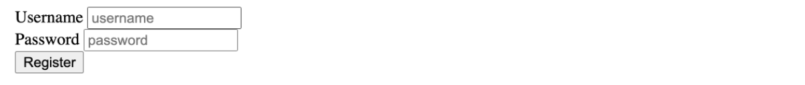

## Exercices :

- Translate [this txt document](./doc-the-chinese-farmer.txt) into semantic html, using the right html tags : `h1`, `h2`, `section`, `blockquote`, `q`, `img`, `p`, `figure` and `caption`, `table`, `th`, `tr`, `td`, `ul` or `ol` and `li`.
- No `div` or `span`: they do not provide any semantics.
- Find, for each of these tags, the origin of their name (that's how we remember them). If in doubt, look for the answer on [html5doctor.com](http://html5doctor.com).
- Add two or three links of your choice in the html page via the tag `a`
- Is there a part that could be considered as a header? If so, group it in a `header` tag.
- And a footer? If so, group this content together in a `footer` tag
- Put all instances of the words "Maybe" in a `em` or `strong` tag.
---

**_Wolf Images & Links Exercise_**
   Let's get some practice with HTML Images and Anchor Elements. In a html file, please do the following:

Create an image element using this source: https://upload.wikimedia.org/wikipedia/commons/5/5f/Kolm%C3%A5rden_Wolf.jpg

The image element should be clickable in order to redirect us to https://en.wikipedia.org/wiki/Wolf in a new tab

Make sure to include some alt text on the image!

---

**_Snowman Logo Exercise_**
   Write an `<h1>` element to recreate the following image:

There is a snowman entity code. Find it! (you will need to google it)

Use the registered trademark entity code (the circled R at the end) , AND be sure to make it superscript

Note: No one expects you to memorize any of the entity codes. Get used to googling them! It's normal!

---

**_Forms Practice Exercise_**
   Let's get some practice with forms, inputs, labels, and buttons! Write a simple form with the following inputs:

   1. Username

      a. Text Input

      b. Should have placeholder text of 'username'

      c. Make sure to properly label the input (using id/for attributes)

   2. Password

      a. Password Input

      b. Should have placeholder text of 'password'

      c. Make sure to properly label the input (using id/for attributes)

   3. A Button
      a. With the inner text 'Register'

I added in some `
` elements for spacing, but you don't need to:

---

Just for practice, inspect a website with your browser and play around changing tags, meta title, content of the texts, etc. Get to know the inspector !

---
