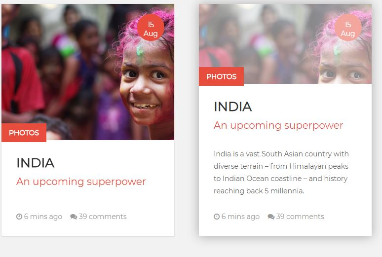

# Animated map in CSS

Exercise to do in ~~Han~~ solo
Duration: **1 day max!**

## Goals
* Become a jedi of css animations.
* Place the animations in a real context

## Instructions :

* In CSS, you will code!
* In English, you will name!
It is important to name your classes correctly and to name them in English. Google translate is your friend.
*Attentive, you will be!
Look closely at all the details that are animated. There is the part below which increases in size, a text which appears, a shadow which forms, a zoom on the photo, and a change of color on this same photo.

Here are the two different states.

## You finished ?
Honestly, well done, you already have quite a good level in css!

