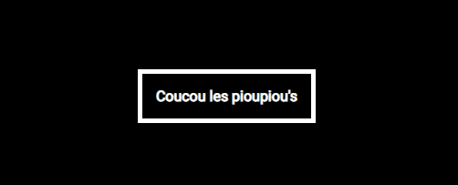

# CSS animations

Animations are used to make a transition between two states of an element. If we take the example of a button, it can therefore have two states: the neutral/normal state and the one which is triggered on mouseover with the *[pseudo-class](https://developer.mozilla.org/en-US/docs/Web/CSS/Pseudo-classes)* ``:hover``. The animations add a little fluidity to the change of state and in this context to the change of background color and link color.

**Without transition**

**With transition**

## Transition VS Animation
There are two CSS properties for making animations: ``transition`` and ``animation``.
In many cases, you will use the ``transition`` property. Transitions are perfect to use when there are only two steps, from neutral state to modified state and vice versa. If we take the example of hovering over the mouse, the transition will automatically be done in "reverse" mode, that is to say that the browser understands that it must make a transition in reverse to return to its state initial when the mouse no longer hovers over the button. Another difference is that transitions need a trigger to launch (hovering a mouse, using scroll, etc.) unlike the ``animation`` property. So if the animation is complex, or if it needs to trigger on its own, then you will need to use the ``animation`` property.

Here are some cases where the ``animation`` property is more appropriate.
- An Animation that repeats itself.
- An animation that has more than two intermediate states/points.
- An animation that starts on its own
- An animation where there is a pause.
- An animation with complex movements (changes of states).

 ##Drill

 **1. Repeat this example**
 

 **2. Reproduce this example without changing the size value in width #DoNotTouchTheWidth**
 

 **3. Reproduce this example without changing the margin #DontTouchTheMargin**
 

 Finished ? OK, you are ready to move on to [the next step](card.md)